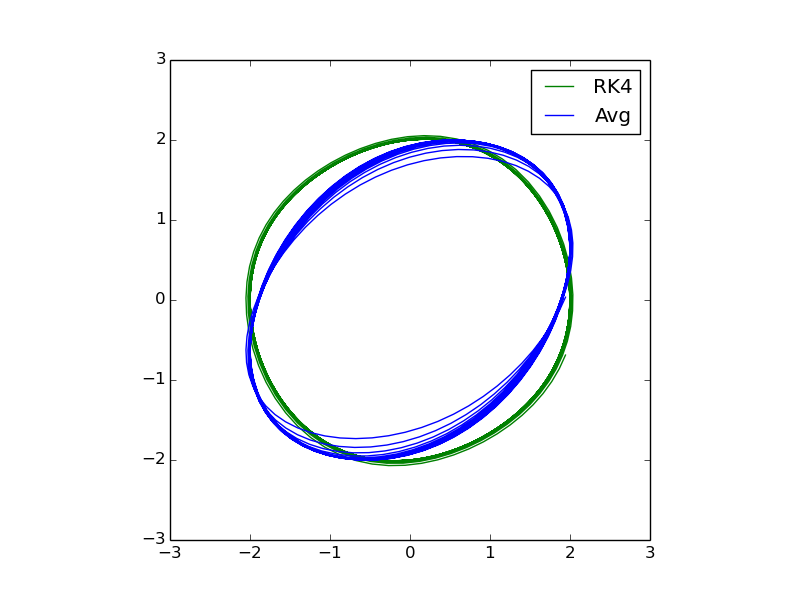
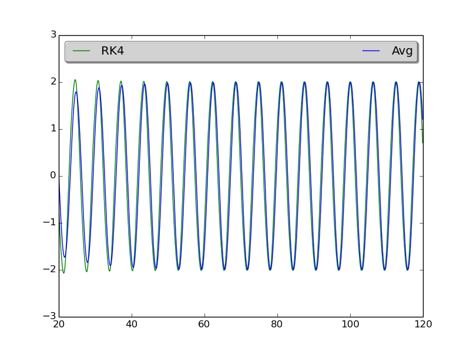

### Vanderpol

This is an script to approximate dynamic systems, 
for instance  Vanderpol using the following methods:

 - Runge Kutta 4 
 - [Method of averaging](https://en.wikipedia.org/wiki/Method_of_averaging)

#### some results

