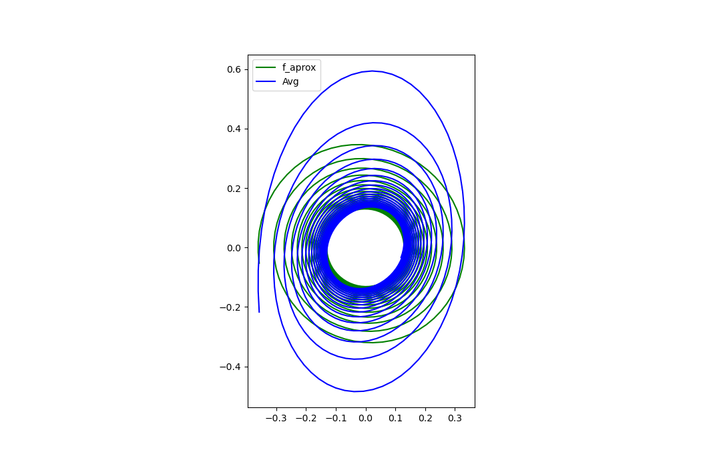

### Vanderpol

This is an script to approximate the function of Vanderpol using 
 - Runge Kutta 4 
 - [Method of averaging](https://en.wikipedia.org/wiki/Method_of_averaging)

Some results displaying the parameter model and the change over time.

